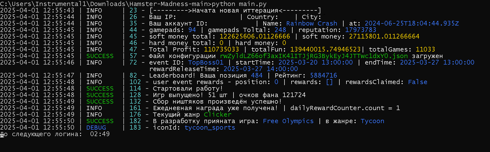
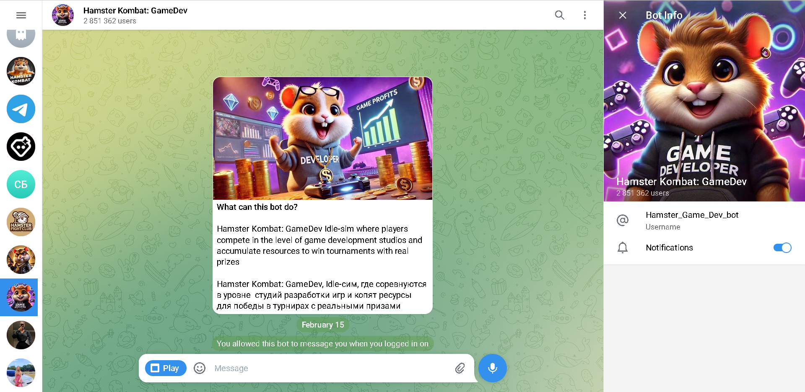
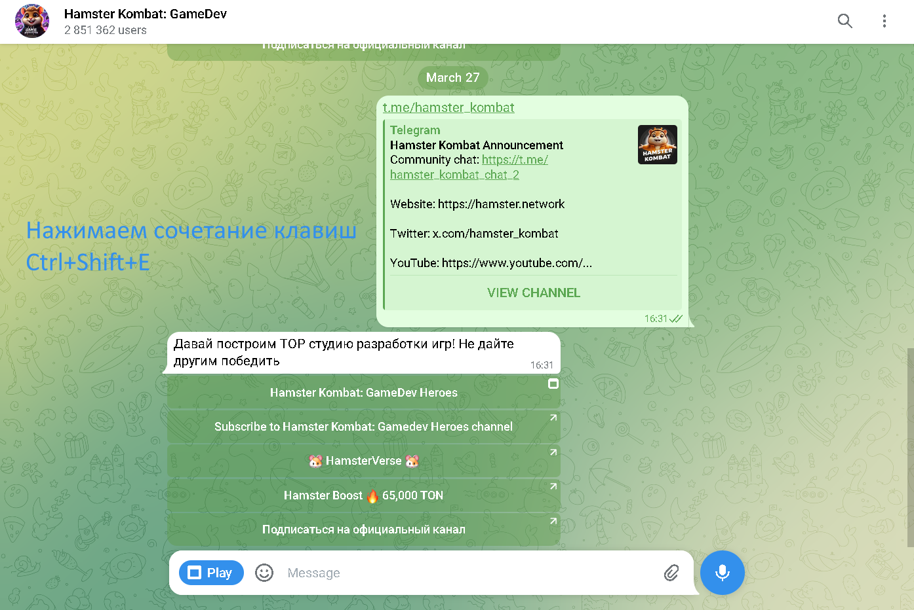
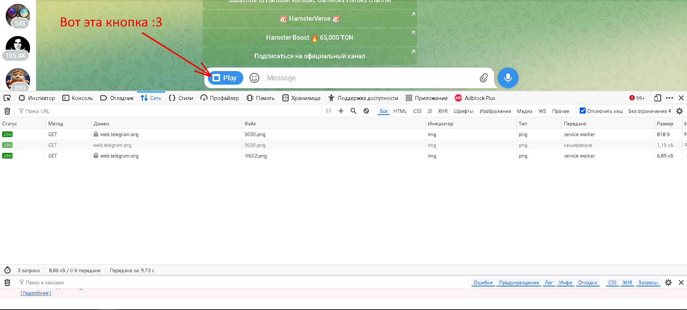

[](https://t.me/Magic0Sparrow)
[](https://www.python.org/downloads/)





## ⚙ [Настройки](.env-example)
<details>
  <summary><b>Coming</b> - soon</summary>
  <p>Test.</p>
  <ul>
    <li><strong>Пример:</strong></li>
    <code>ID=123</code>
    <br>
    <code>HASH=420</code>
  </ul>
</details>


## ⚡ Быстрый старт
1. Чтобы установить библиотеки в Windows, запустите `INSTALL.bat`


## 📌 Зависимости
Прежде чем начать, убедитесь, что у вас установлено следующее:
- [Python](https://www.python.org/downloads/) 


## 📃 Получение API ключей
Перейдите на сайт [web.telegram.org](https://web.telegram.org) и войдите в систему. 
Установите расширение для браузера **"Hamster Madness 2.0"** .
<details>
  <summary>Перейдите к боту <b>@Hamster_Game_Dev_bot</b></summary>
  
</details>

<details>
  <summary>Нажмите Ctrl+Shift+E (инструменты разработчика -> сеть)</summary>
  
</details>


<details>
  <summary>Нажимаем <b>Play/Играть</b></summary>
  
</details>

Находим файл auth-by-telegram-webapp


## 🧱 Установка
# Windows
```
~/Hamster-Madness >>> python -m venv venv
~/Hamster-Madness >>> venv\Scripts\activate
~/Hamster-Madness >>> pip install -r requirements.txt
~/Hamster-Madness >>> copy .env-example .env
~/Hamster-Madness >>> # Откройте файл .env и укажите ваши API_ID и API_HASH
~/Hamster-Madness >>> python main.py
```
    


